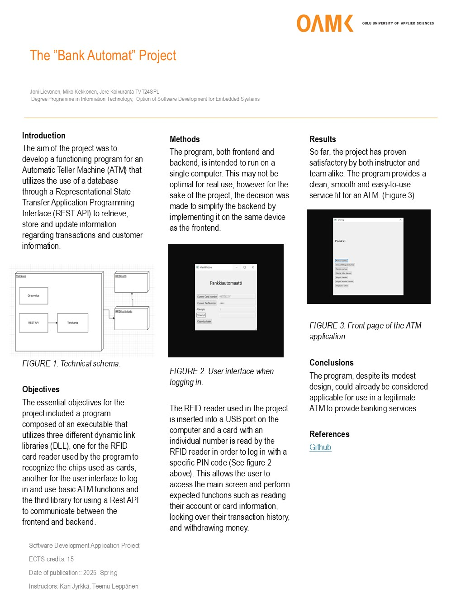

# L20

<h1>ATM Project</h1>

<h2>A description of the software</h2>

    The ATM provides the following features:
    <ul>
    <li>To gain access to the bank, the user is required to sign in using an RFID card and a pin code. Failing to use the correct pin code three times results in the card being locked, thus preventing its usage until the lockdown is lifted from the backend.</li>
    <li>Once in the main bank window the user is able to confirm their balance and account information, deposit- and wihdraw money, go through the account's last 10 actions and sign out.</li>
    </ul>

<h2>ER diagram</h2>

 
 

<h2>Poster</h2>

 

<h2>How to use program</h2>

    Before you start the program
    <ul>
    <li>Install express using "npm install express" in the command line inside the backend folder. Also install mysql2 using "npm install mysql2" and using similar prompts install bcrytpjs, co, dotenv and jsonwebtoken. Start express using npm start.</li>
    <li>Download uniserver and start mysql. Import the bank database to your device from bankdatabasedumb.sql using mySQL Workbench (install the workbench if you don't have it). Add users, cards and accounts into the database using postman.</li>
    </ul>

